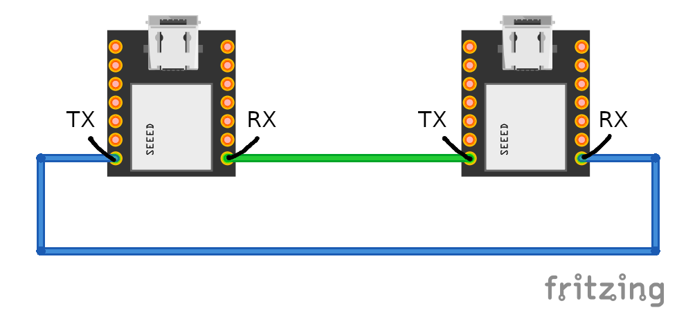
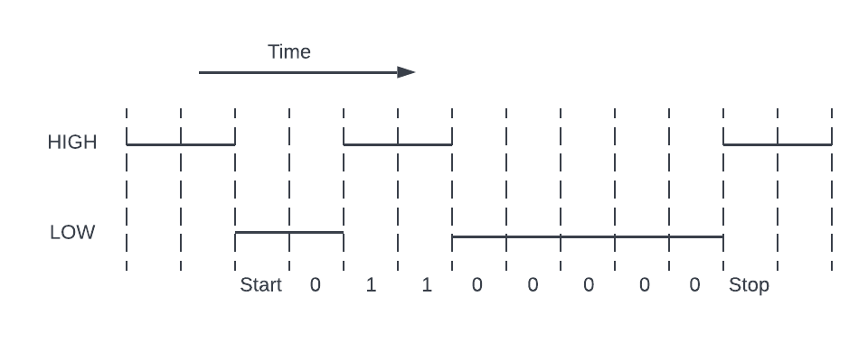
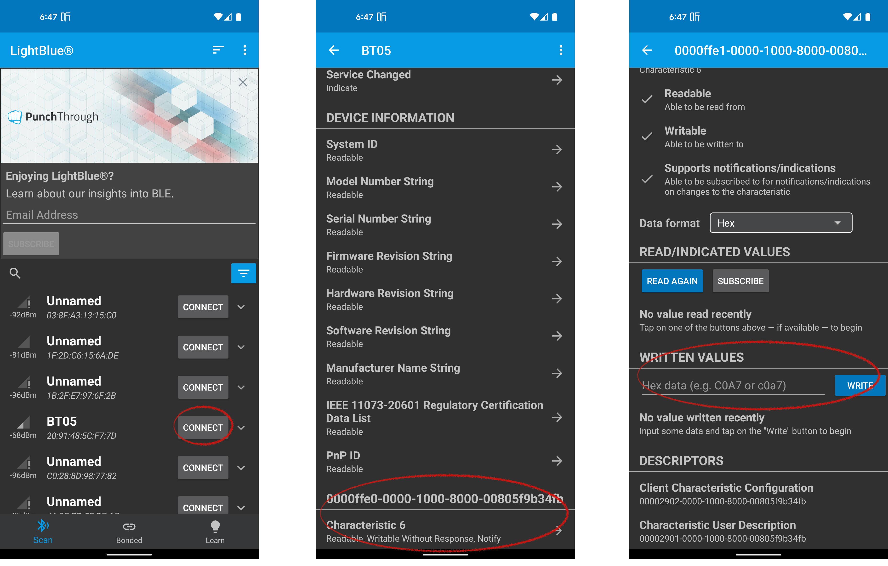

# Bluetooth Test

## Build & Run Instructions

Run `make synth` to generate the bitstream and `make flash` to program the FPGA.

Connect the TXD pin on the Bluetooth module to the slot for ir sensor 0.
Connect GND to ground and VCC to 3.3V power supply.

Pair your phone with the Bluetooth module. The one used in this example is named
"HC-06", but yours might have a different name.

After the module is connected to your phone, you may send numbers to it from
the phone app and see the LED blink.

## Summary

This program is used to test if the UART receiver logic written for the FPGA is functioning correctly.

## Tutorial

### Introduction

In the previous labs we have built a robot that could make decisions on its own (based on sensor readings). However, it is not very fun if we could not interact with the robot. Therefore, in this lab we will attach a Bluetooth UART module to the robot and see how we can "talk to" the robot via Bluetooth.

### Parts

In addition to everything used in previous labs, we will also need the following components / devices:

* A Bluetooth UART module (similar to HM-10 or HC-06)

* An Android phone or PC that supports Bluetooth

### The UART Protocol

Universal Asynchronous Receiver/Transmitter, or UART, is a widely used serial communication protocol. This section is a quick introduction to UART, so if you are already familiar with this protocol, feel free to skip it.

Any device supporting UART would have an RX pin (for receiving data) and a TX pin (for sending data). To form a UART connecting, the RX pin of one device would connect to the TX pin of the other. 

As the name "Universal **Asynchronous** Receiver/Transmitter" suggests, the UART interface does not use a clock signal for synchronization. Instead, the connected devices would agree on a BAUD rate (data transfer speed), and use their internal clocks to generate or sample the data. For example, a BAUD rate of 9600 means 9600 bits per second, or about 104 $\mu s$ per bit (including metadata bits, which we will discuss later).

The UART data transmission is in the form of packets. A packet consists of 1 start bit, 5 to 9 data bits, 0 to 1 parity bit, and 1 to 2 stop bits. In this project, we are using 8 data bits, 0 parity bit, and 1 stop bit per packet.

| Start Bit | Data Bits | Parity Bit | Stop Bit |
| --------- | --------- | ---------- | -------- |
| 1         | 8         | 0          | 1        |

When no data transmission is in place, the transmission line is held at logical *HIGH*. To signal the start of a packet transmission, the TX pin pulls the transmission line *LOW* for 1 cycle (e.g., 104 $\mu s$  at 9600 BAUD rate). Following the start bit, the data bits are sent in order, starting from the least significant bit (bit 0). If even or odd parity is used, the parity bit will be calculated and sent after the data bits. Finally, the transmission line is pulled *HIGH* for 1 or 2 cycles, signalling the end of packet transmission. The following example illustrates how the number "6" is sent using the UART configuration in this lab (starting at cycle 0):

### UART Receiver Logic

Now that we know how UART works, it's time to implement the UART interface on the FPGA board. In this lab we are only trying to send data to the robot, so we only need to implement the receiver. The FPGA clock runs at 16MHz and the BAUD rate we are using is 9600, so each bit in the UART packet takes $16 \times 10^6 \div 9600 = 1666.\dot{6}$ or about $1667$ cycles. To achieve the best reliability, we would like to read each bit right at the middle of its corresponding period. To accomplish this, we first count $1666 \div 2 = 833$ cycles after the transmission line is pulled *LOW* to get to the middle of the start bit, then read the data bit once every $1667$ cycles (and place it in a data register). After all 8 data bits have been read, we again count $1667$ cycles and read the stop bit. Note that the data register holds invalid data during transmission, so we want to make sure the other parts in the system don't accidentally read this invalid data. Here we propose two simple methods:

1. Add a "done" signal which is set to **0** when a start bit is read and **1** when a stop bit is read.

2. Add a "output register" which is updated with the data register content after each stop bit.

There are of course many other methods that can achieve the same goal, so you don't have to use our proposed methods if you have any other brilliant ideas.

### Testing

#### Hardware

To test the UART receiver, we need to connect the TX pin of the Bluetooth module to the user-defined RX pin on FPGA. Because we are not using the line sensor in this lab, we suggest that you remove the line sensor and define one of the IR sensor pins as the FPGA RX pin. The power (VCC) and ground (GND) pins of the Bluetooth module also need to be connected to the correct pins.

We would also like to visualize the data received. In our implementation, we wired (using Verilog) the last four bits of the RX data to the four LEDs on the robot chassis (FrontLeft, FrontRight, BackLeft, and BackRight).

#### Software

Software development is beyond the scope of this lab so we will not discuss how the applications are built here. That being said, the source code is included in the GitHub repository so feel free to explore by yourself if you are interested.

We have built the test program into the Android controller app (which will be used in the next lab). For those who do not own an Android phone, we also provide a python script that can run on a PC with Bluetooth. Alternatively, the [LightBlue&reg;](https://punchthrough.com/lightblue/) app can also be used for testing if you are using a BLE module.

Both the controller app and the python script are fairly easy to use, so we will only go over how to use LightBlue for testing here.

1. First, find the Bluetooth module in the list and connected to it.

2. Then, scroll to the bottom and find a service with the UUID `0000FFE0-0000-1000-8000-00805F9B34FB`. Click on the only characteristic it has.

3. Finally, find the "WRITTEN VALUES" section and use that to send numbers to the connected Bluetooth module.

### Conclusions

Now that you have completed this lab and have learned the basics of UART communication. You might be thinking, "I can now send numbers to the robot and control the LEDs, but that's not very interesting." And you might want to know that we agree with you. However, the goal of this lab is to prepare you for the next one: the Bluetooth Remote-Controlled Car, which should be a very fun lab.
